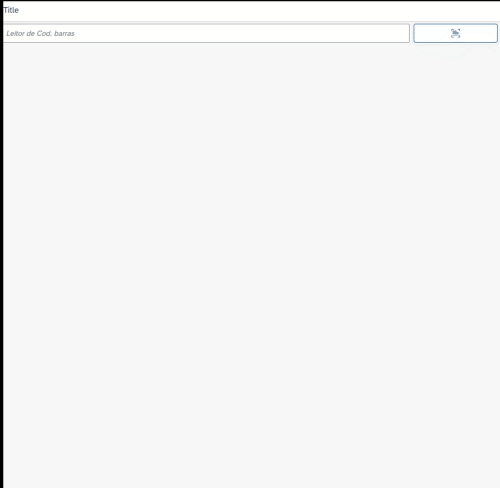

# ui5BarCodeReader

UI5BarCodeReader is a neat package powered by Quagga.js to add a input with barcode reading capabilities.

UI5BarCodeReader é um pacote impulsionado por Quagga.js para adicionar um input com capacidade para leitura de código de barras.



## Installation/Instalação

Copy folder webapp/lib to /webapp folder in your project. Change also the bundleName of /webapp/lib/models.js to your project namespace.

Copie a pasta /webapp/lib para a pasta /webapp do seu projeto. Altere também o bundleName do arquivo /webapp/lib/models.js para o namespace do seu projeto.

## Usage/Uso

Add namespace in view.xml

Adicione o namespace à sua view.xml
```xml
<mvc:View
	controllerName="barcodereader.barcodereader.controller.ViewBarCodeReader"
	xmlns:mvc="sap.ui.core.mvc"
	displayBlock="true"
	xmlns="sap.m"
	xmlns:brc="barcodereader.barcodereader.libs.UI5BarCodeReader"
>
```
Add control in view.xml
Adicione o control ao view.xml
```xml
...
<brc:BarCodeReader  id="barCodeReader"
					submit="onBarCodeSubmit"
					detect="onCameraDetection"
					closeOnDetect="true"  />
```
## Properties/Propriedades

- **title**: Dialog title/Titulo da janela;
- **closeText**: Close dialog text/Texto para ação de fechar a janela;
- **closeIcon**: Close icon on dialog/Ícone de fechamento da janela;
- **changeCameraText**: Camera switch button text/Texto do botão de trocar câmera;
- **changeCameraIcon**: Camera switch button icon/Ícone do botão de trocar câmera;
/* Input de Chave */
- **inputPlaceholder**: Input placeholder text/Texto do "placeholder" no input;
- **value**: Value/valor;
- **openDialogText**: Dialog open button text/Texto do botão de abrir da janela;
- **showDialogText**: Dialog show button text/Texto do botão de mostrar da janela;
- **openDialogIcon**: Dialog open button icon/Ícone do botão de abrir da janela;
- **openDialogWidth**:  Dialog open button width/Largura do botão de abrir da janela;
- **closeOnDetect**: Close dialog on detect barcode/Fecha janela ao detectar código de barras;
- **showInput**: Show input value/Mostrar input;

## Contributing/Contribuição

Pull requests are welcome. For major changes, please open an issue first to discuss what you would like to change.

Please make sure to update tests as appropriate.

Solicitações pull são bem-vindas. Para mudanças importantes, abra um problema (issue) primeiro para discutir o que você gostaria de mudar.  Certifique-se de atualizar os testes conforme apropriado.

## License/Licença
[MIT](https://choosealicense.com/licenses/mit/)